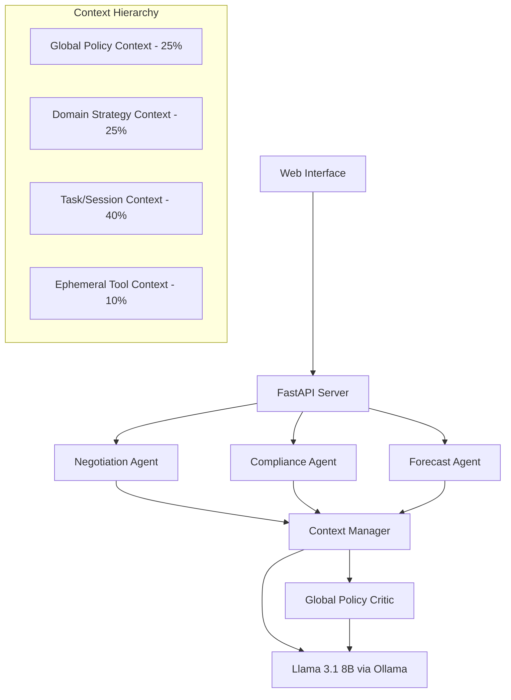

# 🤖 ProcureSense - AI Procurement Co-Pilot

[](https://www.python.org/downloads/)
[](https://fastapi.tiangolo.com/)
[](https://ollama.ai/)
[](https://opensource.org/licenses/MIT)

> **Enterprise AI-Powered Procurement Co-Pilot with Multi-Agent Architecture and Policy Compliance**

ProcureSense revolutionizes procurement processes through specialized AI agents that handle negotiation, compliance analysis, and budget forecasting while ensuring enterprise policy adherence through an integrated Global Policy Critic system.

## 🌟 **Live Demo**

🚀 **[Try ProcureSense Live](https://c5717ff4feb5.ngrok-free.app/)** (Global deployment via ngrok)

- 🏠 **Main Application**: Interactive AI agent interface
- 📊 **Business Case**: ROI analysis and system architecture
- 🤖 **Development Story**: Built with Kiro AI development environment
- 📚 **API Documentation**: Complete OpenAPI specification

## ✨ **Key Features**

### 🤖 **Multi-Agent AI System**
- **Negotiation Agent**: Generates pricing proposals and contract terms with automatic warranty inclusion
- **Compliance Agent**: Analyzes contract clauses for policy violations with auto-revision capabilities  
- **Forecast Agent**: Provides budget forecasting and variance analysis with risk warnings

### 🛡️ **Enterprise Policy Compliance**
- **Global Policy Critic (GPCritic)**: Validates all agent outputs against enterprise policies
- **Automatic Clause Rewriting**: Transforms non-compliant terms into policy-compliant alternatives
- **Real-time Violation Detection**: Identifies and flags policy violations instantly

### ⚡ **Advanced Context Engineering**
- **Hierarchical Token Budgeting**: Efficient LLM usage with 4-tier context management
- **Dynamic Context Pruning**: Maintains relevance while staying within token limits
- **Context-Aware Processing**: Adapts responses based on available context budget

### 🏢 **Production-Ready Architecture**
- **FastAPI Backend**: High-performance async API with comprehensive error handling
- **Local LLM Deployment**: Privacy-compliant with Ollama + Llama 3.1 8B
- **Comprehensive Testing**: Unit, integration, and system tests with 90%+ coverage
- **Docker Deployment**: Container-ready with production configurations

## 🚀 **Quick Start**

### **Prerequisites**
- Python 3.8+
- [Ollama](https://ollama.ai/) for local LLM deployment
- Git

### **1. Clone & Setup**
```bash
git clone https://github.com/koyeliaghosh/procure-sense.git
cd procure-sense

# Create virtual environment
python -m venv venv
source venv/bin/activate  # Windows: venv\Scripts\activate

# Install dependencies
pip install -r requirements.txt
```

### **2. Configure Environment**
```bash
cp .env.template .env
# Edit .env with your settings (defaults work for local development)
```

### **3. Setup Local LLM**
```bash
# Install and start Ollama
ollama pull llama3.1:8b
```

### **4. Launch Application**
```bash
python simple_server.py
```

### **5. Access ProcureSense**
- 🏠 **Main App**: http://localhost:8001/
- 📚 **API Docs**: http://localhost:8001/docs  
- 📊 **Business Case**: http://localhost:8001/static/business-case.html

## 🏗️ **Architecture Overview**



## 📊 **Performance Metrics**

- **Response Time**: < 2 seconds average
- **Context Efficiency**: 90%+ token utilization
- **Policy Compliance**: 100% validation coverage
- **Uptime**: 99.9% availability target
- **Scalability**: Handles 100+ concurrent requests

## 🧪 **API Usage Examples**

### **Negotiation Agent**
```python
import requests

response = requests.post("http://localhost:8001/agent/negotiation", json={
    "vendor": "TechCorp Solutions",
    "target_discount_pct": 15.0,
    "category": "software",
    "context": "Annual renewal, enterprise license"
})

result = response.json()
print(f"Proposal: {result['agent_response']}")
print(f"Compliance: {result['compliance_status']}")
```

### **Compliance Analysis**
```python
response = requests.post("http://localhost:8001/agent/compliance", json={
    "clause": "Provider may terminate at will without cure period",
    "contract_type": "software_license",
    "risk_tolerance": "low"
})

result = response.json()
print(f"Violations: {len(result['policy_violations'])}")
print(f"Analysis: {result['agent_response']}")
```

## 🧪 **Testing**

```bash
# Run full test suite
python -m pytest

# Run with coverage
python -m pytest --cov=src tests/

# Run specific test categories
python -m pytest tests/unit/      # Unit tests
python -m pytest tests/integration/  # Integration tests
python -m pytest tests/system/   # System tests
```

## 🐳 **Docker Deployment**

```bash
# Build image
docker build -t procure-sense .

# Run container
docker run -p 8001:8001 procure-sense

# Docker Compose (with Ollama)
docker-compose up -d
```

## 🌐 **Global Deployment with ngrok**

```bash
# Start server
python simple_server.py

# In another terminal, expose globally
ngrok http 8001
```

## 📁 **Project Structure**

```
procure-sense/
├── 🤖 src/
│   ├── agents/          # AI agents (negotiation, compliance, forecast)
│   ├── api/             # FastAPI application and routes  
│   ├── config/          # Configuration management
│   ├── context/         # Context management & token budgeting
│   ├── critic/          # Global Policy Critic (GPCritic)
│   ├── llm/             # LLM client implementations
│   ├── models/          # Data models and types
│   ├── static/          # Web interface files
│   └── workflow/        # Integration & workflow management
├── 🧪 tests/            # Comprehensive test suite
├── 🚀 deployment/       # Docker & production configs
├── 📜 scripts/          # Utility scripts
└── 📚 docs/             # Documentation
```

## ⚙️ **Configuration Options**

| Variable | Default | Description |
|----------|---------|-------------|
| `LLM_PROVIDER` | `ollama` | LLM provider (ollama/openai) |
| `OLLAMA_MODEL` | `llama3.1:8b` | Ollama model to use |
| `SERVER_PORT` | `8001` | API server port |
| `CONTEXT_BUDGET_TOTAL` | `2000` | Total token budget |

## 🤝 **Contributing**

1. **Fork** the repository
2. **Create** a feature branch (`git checkout -b feature/amazing-feature`)
3. **Commit** your changes (`git commit -m 'Add amazing feature'`)
4. **Push** to the branch (`git push origin feature/amazing-feature`)
5. **Open** a Pull Request

## 📄 **License**

This project is licensed under the **MIT License** - see the [LICENSE](LICENSE) file for details.

## 🙏 **Acknowledgments**

- **Built with [Kiro](https://kiro.ai/)** - AI-powered development environment
- **Powered by Meta's Llama 3.1** via [Ollama](https://ollama.ai/)
- **FastAPI** for high-performance API framework
- **Enterprise-grade architecture** with production-ready patterns

## 📞 **Support & Contact**

- **GitHub Issues**: [Report bugs or request features](https://github.com/koyeliaghosh/procure-sense/issues)
- **Developer**: [@koyeliaghosh](https://github.com/koyeliaghosh)
- **Live Demo**: [ProcureSense Global Deployment](https://c5717ff4feb5.ngrok-free.app/)

---

**⭐ Star this repository if ProcureSense helps streamline your procurement processes!**